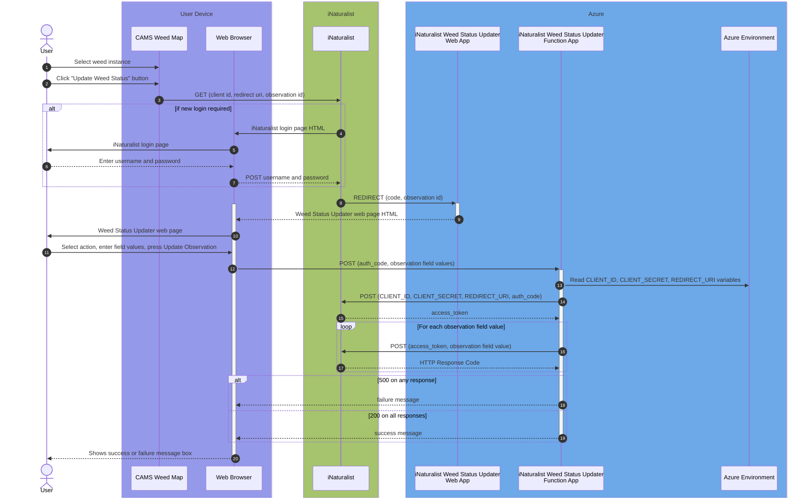

# iNaturalist Weed Status Updater

The iNaturalist Weed Status Updater is a web app that sets specific observation field values on iNaturalist observations. The observation fields are defined in the [Weed Management Aotearoa NZ iNaturalist](https://www.inaturalist.org/projects/weed-management-aotearoa-nz) project which is used for defining and managing the status of weed plants.

The user must authenticate with iNaturalist using their individual iNaturalist profile which authorises them to set the observation field values. 

## User View

1. The iNaturalist to CAMS synchroniser performs an hourly update of CAMS with any new or modfied observations. 

1. When clicking on a weed in CAMS that has been synchronised from iNaturalist, the pop-up shows an "Update weed status" button.

1. Clicking on the "Update weed status" button displays the web app.

1. iNaturalist prompts the user for their credentials if they are not logged in to iNaturalist. After filling in the fields the user clicks on the Update Observation button which then updates the relevant iNaturalist observation fields as the logged-in iNaturalist user.

## System View

The authentication is achieved using iNaturalist's [OAuth2 Authorization Code Flow](https://www.inaturalist.org/pages/api+reference#auth).

The Authorization Code Flow redirects the user to the web app, a VueJS app deployed as an Azure Static Web App. This app calls a Python based Azure Serverless Function App which updates iNaturalist. 

This flow is shown in the following sequence diagram:



Here's a description of the numbered steps on this sequence diagram:
1. The user selects a Weed Instance on the CAMS Map (running on ArcGIS Field Map or Experience Builder). The Weed Instance must have been generated from iNaturalist (using the [iNaturalist to CAMS synchroniser](https://github.com/EcoNet-NZ/inaturalist-to-cams))
1. This shows a pop-up on the CAMS Weed Map with an "Update Weed Status" button. 
1. When the user clicks on this button it performs a GET request to the iNaturalist OAuth2 endpoint with hardcoded `client id` and `redirect uri` parameters plus a `state` parameter containing the iNaturalist `observation id` of the Weed Instance.
1. iNaturalist determines whether a new login is required. If so, iNaturalist returns the login page HTML. If not, jump to step 8.
1. The iNaturalist login page is displayed on the browser.
1. The user enters their username and password (assumed to be valid for this flow, otherwise an error is displayed and the flow stops).
1. On submitting the username and password, they are submitted as a `POST` request to iNaturalist.
1. iNaturalist `REDIRECT`s the user to the iNaturalist Weed Status Updater web app (the URL of which was passed as the `redirect_uri` parameter in step 3). This redirect includes a `code` parameter containing the authorization code generated by iNaturalist and a `state` parameter containing the observation id (passed in step 3).
1. The web app returns the Weed Status Updater HTML.
1. The browser displays the Weed Status Updater.
1. The user selects the action to update the weed status (eg Controlled, Alive, Dead, Duplicate), fills in relevant fields and presses the Update Observation button.
1. The web page posts to the Function App the authorization code, the observation id and the observation field values.
1. The Function App reads the CLIENT_ID, CLIENT_SECRET and REDIRECT_URI from the Azure environment variables.
1. The Function App calls the iNaturalist OAuth2 endpoint passing these variables plus the authorization code.
1. The iNaturalist OAuth2 endpoint returns the access token.
1. For each observation field value, the Function App calls iNaturalist with the access token, the observation field id and the observation field value.
1. iNaturalist returns a response code (for each observation field value call).
1. If any of these calls results in a 500 error response, the flow stops immediately. The Function App returns a failure response code to the web page.
1. If all of the calls result in a 200 OK response, the Function App returns a success response to the web page.
1. The web page displays either a success or failure message to the user dependent on which of the above two steps was executed.

## Getting Started


## Project setup
```
npm install
```

### Compiles and hot-reloads for development
```
npm run serve
```

### Compiles and minifies for production
```
npm run build
```

### Lints and fixes files
```
npm run lint
```

### Customize configuration
See [Configuration Reference](https://cli.vuejs.org/config/).
