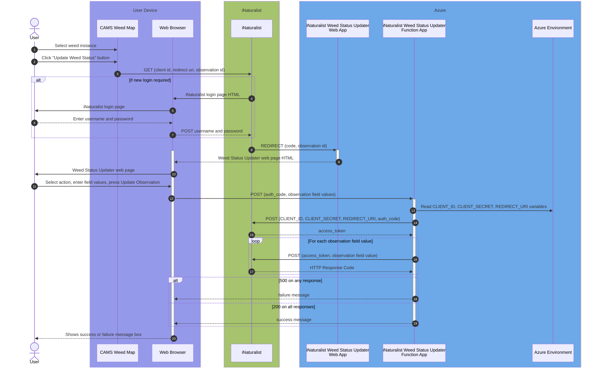

# iNaturalist Weed Status Updater

Provides a web app to update the status of observation fields on iNaturalist observations.

The user must authenticate using iNaturalist to be authorised to set the observation field values. This authentication is achieved using iNaturalist's [OAuth2 Authorization Code Flow](https://www.inaturalist.org/pages/api+reference#auth).

The Authorization Code Flow redirects the user to the web app, which is a VueJS app deployed as an Azure Static Web App calling a Python based Azure Serverless Function App which updates iNaturalist. 

This flow is shown in the following sequence diagram:



Here's a description of the numbered steps on this sequence diagram:
1. The user selects a Weed Instance on the CAMS Map (running on ArcGIS Field Map or Experience Builder). The Weed Instance must have been generated from iNaturalist (using the [iNaturalist to CAMS synchroniser](https://github.com/EcoNet-NZ/inaturalist-to-cams))
1. This shows a pop-up on the CAMS Weed Map with an "Update Weed Status" button. 
1. When the user clicks on this button it performs a GET request to the iNaturalist OAuth2 endpoint with hardcoded `client id` and `redirect uri` parameters plus a `state` parameter containing the iNaturalist `observation id` of the Weed Instance.
1. iNaturalist determines whether a new login is required. If so, iNaturalist returns the login page HTML. If not, jump to step 8.
1. The iNaturalist login page is displayed on the browser.
1. The user enters their username and password (assumed to be valid for this flow, otherwise an error is displayed and the flow stops)
1. On submitting the username and password, they are submitted as a `POST` request to iNaturalist
1. iNaturalist `REDIRECT`s the user to the iNaturalist Weed Status Updater web app (the URL of which was passed as the `redirect_uri` parameter in step 3). This redirect includes a `code` parameter containing the authorization code generated by iNaturalist and a `state` parameter containing the observation id (passed in step 3).
1. The web app returns the Weed Status Updater HTML.
1. The browser displays the Weed Status Updater.


The observation fields that are updated are defined in the [Weed Management Aotearoa NZ iNaturalist](https://www.inaturalist.org/projects/weed-management-aotearoa-nz) project.

TBC


## Project setup
```
npm install
```

### Compiles and hot-reloads for development
```
npm run serve
```

### Compiles and minifies for production
```
npm run build
```

### Lints and fixes files
```
npm run lint
```

### Customize configuration
See [Configuration Reference](https://cli.vuejs.org/config/).
