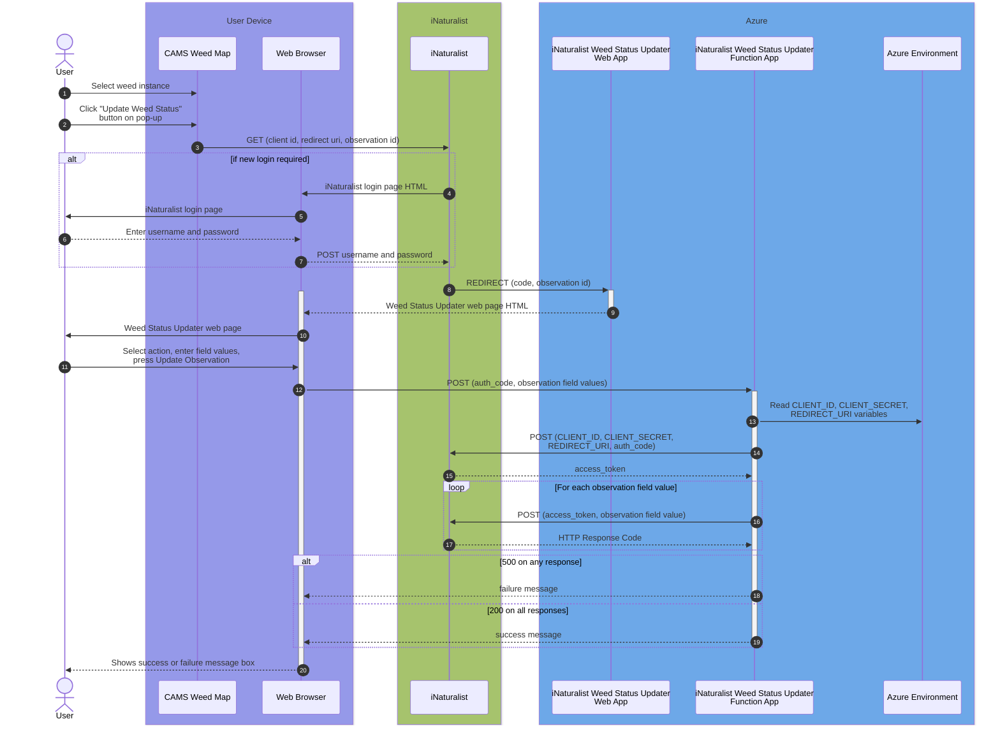

# iNaturalist Weed Status Updater

The iNaturalist Weed Status Updater is a web app that sets specific observation field values on iNaturalist observations. The user must authenticate with iNaturalist using their individual iNaturalist profile which authorises them to set the observation field values.

The observation fields used in this project are defined in the [Weed Management Aotearoa NZ iNaturalist](https://www.inaturalist.org/projects/weed-management-aotearoa-nz) iNaturalist project which is used for defining and managing the status of weed plants. It is used in conjunction with EcoNet's [CAMS](https://econet.nz/our-projects/) Weeds Map, an ArcGIS map which displays weed instances, some of which are sourced from iNaturalist observations.

## User View

1. The [**iNaturalist to CAMS synchroniser**](https://github.com/EcoNet-NZ/inaturalist-to-cams) performs an hourly update to the CAMS Weeds Map with any new or modfied observations of interest.

1. In **CAMS**, when clicking on a weed instance that has been synchronised from iNaturalist, the pop-up shows an "Update weed status" button.

1. In **CAMS**, clicking on the "Update weed status" button calls the **iNaturalist Weed Status Updater**, which authorises the user using iNaturalist. If the user is not logged into iNaturalist, iNaturalist prompts the user for their credentials. 

1. The **iNaturalist Weed Status Updater web app** is then displayed. After filling in the fields, the user clicks on the "Update Observation" button which then updates the relevant iNaturalist observation fields as the logged-in iNaturalist user.

## System View

The user is authenticated using iNaturalist's [OAuth2 Authorization Code Flow](https://www.inaturalist.org/pages/api+reference#auth).

After logging in, if required, the Authorization Code Flow redirects the user to the web app, a VueJS app deployed as an Azure Static Web App. This app calls a Python based Azure Serverless Function App which updates iNaturalist. 

This flow is shown in the following sequence diagram:

Here's a description of the numbered steps on this sequence diagram:
1. The user selects a Weed Instance on the **CAMS** Weeds Map (running on ArcGIS Field Map or Experience Builder).
1. If the Weed Instance was sourced from iNaturalist (using the [iNaturalist to CAMS synchroniser](https://github.com/EcoNet-NZ/inaturalist-to-cams), the pop-up shows an "Update Weed Status" button. 
1. When the user clicks on this button it performs a GET request to the **iNaturalist OAuth2 endpoint** with hardcoded `client id` and `redirect uri` parameters plus a `state` parameter containing the iNaturalist `observation id` of the Weed Instance.
1. iNaturalist determines whether a new login is required. If so, iNaturalist returns the login page HTML. If not, jump to step 8.
1. The iNaturalist login page is displayed on the browser.
1. The user enters their username and password (assumed to be valid for this flow, otherwise an error is displayed and the flow stops).
1. On submitting the username and password, they are submitted as a `POST` request to iNaturalist.
1. iNaturalist `REDIRECT`s the user to the **iNaturalist Weed Status Updater web app** (the URL of which was passed as the `redirect_uri` parameter in step 3). This redirect includes a `code` parameter containing the authorization code generated by iNaturalist and a `state` parameter containing the observation id (passed in step 3). These two parameters are read in the `created: function()` of `App.vue`. The `App.vue` file also contains a template of the user interface with the header, visit date field and an `iNaturalistUpdater` component for each of the potential states (Contolled, Alive, Dead or Duplicate).
1. The web app returns the Weed Status Updater HTML.
1. The browser displays the Weed Status Updater.
1. The user selects the action to update the weed status (eg Controlled, Alive, Dead, Duplicate), fills in relevant fields and presses the Update Observation button (defined in `./components/iNaturalistUpdater.vue`).
1. The `updateObservation()` method POSTs to the **Function App** (at `/api/update`) the authorization code, the observation id and the observation field values. This calls the `update()` method in `function_app.py`.
1. The Function App reads the CLIENT_ID, CLIENT_SECRET and REDIRECT_URI from the Azure environment variables.
1. The Function App POSTs to the iNaturalist OAuth2 endpoint passing these variables plus the authorization code.
1. The iNaturalist OAuth2 endpoint responds with the access token.
1. For each observation field value, the Function App POSTs to the **iNaturalist API** with the access token, the observation field id and the observation field value.
1. iNaturalist responds with a response code (for each observation field value call).
1. If any of these calls results in a 500 error response, the flow stops immediately. The Function App returns a failure response code to the web page.
1. If all of the calls result in a 200 OK response, the Function App returns a success response to the web page.
1. The web page displays either a success or failure message to the user dependent on which of the above two steps was executed.

## Creating your own custom iNaturalist updater
Should you wish to clone and modify this project, you'll also need to:

### Set up iNaturalist application
* Gain approval to create an [iNaturalist application](https://www.inaturalist.org/oauth/applications/new). In addition to filling out the form, your iNaturalist account must be at least 2 months old and you must have made at least 10 improving identifications over the last month - I found I needed to add an identification of a finer rank of Order towards improving other user's observations (not your own). 
* Once approved create the [iNaturalist application](https://www.inaturalist.org/oauth/applications/new). You'll want to add a placeholder for the Redirect URI until you have created the web app, you can come back and update this later. Check the Confidential box (assuming you're storing the credentials securely, eg as Azure environment variables).
* Store the client **ID** and **Secret** variables securely as the `CLIENT_ID` and `CLIENT_SECRET` environment variables on your machine, so you can try out the code locally. You'll also need to store these as Azure environment variables.

### Set up Azure account
* Create an Azure account. These exercises are useful for learning about Azure Static Web Apps and Function Apps:
    * [Publish a **Vue** JavaScript app with Azure Static Web Apps](https://learn.microsoft.com/en-us/training/modules/publish-app-service-static-web-app-api/)
    * [Publish an API to Azure Static Web Apps](https://learn.microsoft.com/en-us/training/modules/publish-static-web-app-api-preview-url/)
    
* Create a new Azure Static Web App to use for your application.

* Set up the environment variables for the iNaturalist `CLIENT_ID` and `CLIENT_SECRET` obtained from iNaturalist (above) and the `REDIRECT_URI` environment variable to the external URL of the Static Web App (e.g. `https://[unique-id].azurestaticapps.net`). See [how to set environment variables in the Azure portal](https://learn.microsoft.com/en-us/azure/static-web-apps/application-settings).

### Set the redirect uri on the iNaturalist application
* Edit the iNaturalist application and update the redirect URI to the external URL of the Static Web App (e.g. `https://[unique-id].azurestaticapps.net`).

### Copy this GitHub project and develop your application
* You'll need to merge the code in this project with the `.github/workflows` workflow from the newly created Azure Static Web App.
* Update the code as required.
* Creating a pull request on GitHub will generate a staging version of your app enabling a preview version of your site before publishing it. It won't be fully hooked up to iNaturalist since we have used the production URL as the redirect URI.
* Merging the pull request into your main branch will deploy the updated app to your production URL.

### Construct a URL to call your application
Construct the URL to start the flow at step 3 of the sequence diagram above. Given the `<client id>` from iNaturalist, the encoded URL (i.e. `https://` replaced with `https%3A%2F%2F`) of the Static Web App as `<redirect uri>` and the `<observation id>` of the observation you want to update, the URL will be:
`https://www.inaturalist.org/oauth/authorize?client_id=<client id>&redirect_uri=<redirect uri>&response_type=code&state=<observation id>`

## Hints
* `App.vue` contains the web app entry point and template, which then includes `iNaturalistUpdater` components.
* in addition to the component layout, `iNaturalistUpdater.vue` also defines the Observation Field Values that are to be updated as well as options for dropdown values, validation logic etc.
* Assuming you're only updating observation fields, you shouldn't need to change `function_app.py`.

## Feedback
We'd love your feedback, questions, issues and pull requests on this project. Get in touch if you need help getting it up and running. There's likely to be things I've missed in the instructions above.
